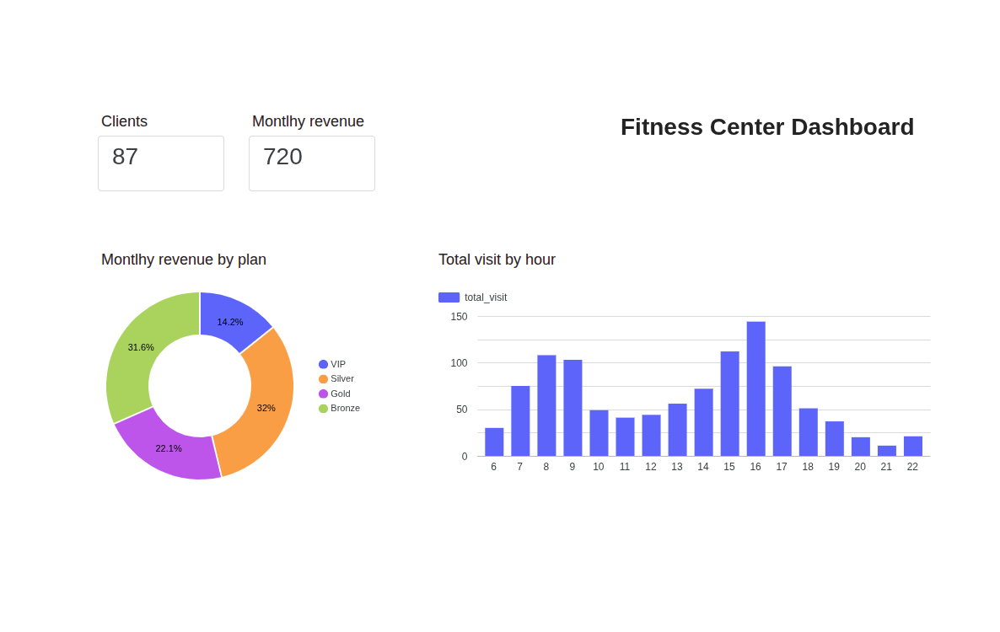

# 🏋️ Fitness Center Data Analysis Project

This project focuses on extracting, transforming, and visualizing operational and financial data from a fitness center database. The objective is to convert raw transactional records into actionable business insights regarding membership sales, gym attendance patterns, and revenue distribution.

---

## 📊 Business Intelligence Dashboard

Below is the interactive dashboard developed in **Google Looker Studio**, which serves as the visual and analytical layer of this project:



---

## 🔑 Key Performance Indicators & Visualizations Included

* **Total Active Members:** A real-time scorecard displaying the total number of gym members with an active membership status.
* **Monthly Revenue (MRR):** A financial KPI scorecard showing the total monthly recurring revenue generated from successfully paid subscriptions (`payment_status = 'Paid'`).
* **Monthly Revenue by Plan:** A dynamic Donut Chart illustrating the revenue distribution percentage across the 4 main membership tiers (*Bronze, Silver, Gold, VIP*), highlighting which plan drives the highest profit.
* **Hourly Activity (Peak Hours Analysis):** A 24-hour Bar Chart displaying the distribution of member check-ins throughout the day. This visualization effectively identifies peak attendance hours (such as the late afternoon rush between 16:00 and 17:00) to assist with gym staffing and resource planning.

---

## 🛠️ Tech Stack & Data Pipeline Architecture

1. **Database Layer (PostgreSQL):** Raw transactional data regarding members, plans, payments, and check-ins was hosted and queried using PostgreSQL.
2. **Extract & Transform (SQL & DBeaver):** Advanced SQL queries utilizing relational joins, conditional filtering, aggregations, and date/time extractions (`EXTRACT(HOUR FROM check_in_time)`) were designed and optimized to generate clean reporting tables.
3. **Load & Data Warehouse Layer (Google Sheets):** The structured query results were exported into dedicated spreadsheet reports (`mrr_report`, `check_ins_report`) to serve as a stable data source.
4. **Visualization Layer (Google Looker Studio):** Fields were strictly cast into appropriate data types (`Numeric` and `Currency` configurations) to ensure precise, bug-free dynamic visualizations and seamless reporting.

---

## 📜 Core SQL Queries Used

### 1. Active Members KPI
```sql
SELECT COUNT(*) AS active_members 
FROM members 
WHERE status = 'Active';
```
2. Monthly Revenue by Plan (MRR)
```sql
SELECT 
    mp.plan_name,
    COUNT(s.subscription_id) AS active_subscriptions,
    SUM(mp.monthly_price) AS total_monthly_revenue
FROM subscriptions s
JOIN membership_plans mp ON s.plan_id = mp.plan_id
JOIN members m ON s.member_id = m.member_id
WHERE m.status = 'Active' AND s.payment_status = 'Paid'
GROUP BY mp.plan_name;
```
3. Peak Hours Analysis (Hourly Check-ins)
```sql
SELECT 
    EXTRACT(HOUR FROM check_in_time) AS check_in_hour,
    COUNT(*) AS total_visits
FROM check_ins
GROUP BY check_in_hour
ORDER BY check_in_hour;
```
